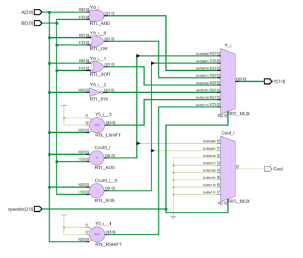
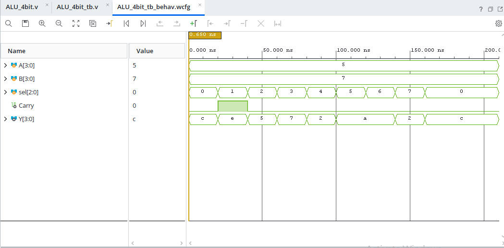

# 4-Bit ALU using Verilog HDL

## Overview

This project implements a **4-Bit Arithmetic Logic Unit (ALU)** using **Verilog HDL**. The ALU performs eight arithmetic and logical operations on two 4-bit input operands. The operation is selected using a **3-bit selection line**. The design was developed and verified using **Xilinx Vivado 2026.1**.

---

## Features

* 4-bit ALU designed using Verilog HDL
* Eight arithmetic and logical operations
* Operation selection using a 3-bit control line
* Functional simulation using a Verilog testbench
* RTL schematic generation
* Simulation waveform verification
* Developed using Xilinx Vivado 2026.1

---

## Operations Supported

| Selection Line | Operation            |
| -------------- | -------------------- |
| 000            | Addition (A + B)     |
| 001            | Subtraction (A - B)  |
| 010            | Bitwise AND (A & B)  |
| 011            | Bitwise OR (A | B)   |
| 100            | Bitwise XOR (A ^ B)  |
| 101            | Bitwise NOT (~A)     |
| 110            | Left Shift (A << 1)  |
| 111            | Right Shift (A >> 1) |

---

## Tools Used

* **Hardware Description Language:** Verilog HDL
* **EDA Tool:** Xilinx Vivado 2026.1
* **Simulator:** Vivado XSIM
* **Operating System:** Windows

---

## Project Structure

```text
.
├── major_project.xpr
├── major_project.srcs/
│   ├── sources_1/
│   │   └── ALU_4bit.v
│   └── sim_1/
│       └── ALU_4bit_tb.v
├── rtl_schematic.png
├── waveform_simulation.png
├── .gitignore
└── README.md
```

---

## Project Files

* **ALU_4bit.v** – Main Verilog source code
* **ALU_4bit_tb.v** – Testbench used for functional verification
* **major_project.xpr** – Vivado project file
* **rtl_schematic.png** – RTL schematic generated by Vivado
* **waveform_simulation.png** – Simulation waveform showing the ALU operations

---

## How to Run

1. Open `major_project.xpr` in Xilinx Vivado 2026.1.
2. Open the Verilog source and testbench files.
3. Run **Behavioral Simulation**.
4. Verify the simulation waveform.
5. Open **RTL Analysis** to view the RTL schematic.

---

## Results

### RTL Schematic



### Simulation Waveform



The simulation confirms that the counter increments correctly on each clock pulse and wraps back to zero after reaching the maximum count.

---

## Author

**Prasanna Lakshmi**

---

## License

This project is intended for educational and learning purposes.
